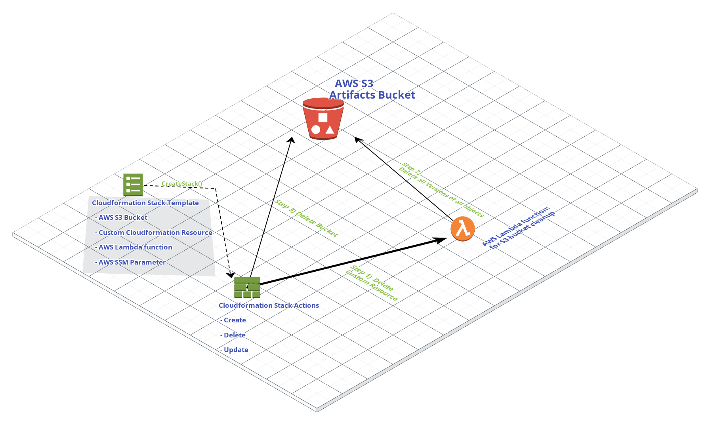

# Custom cloudformation-bucket-cleanup
This repo contains the code that can help with AWS S3 bucket deletion initiated by Cloudformation. 

## Overview
Feel free to use this template as a starting point for your Cloudformation stack or copy and paste the YAML for the custom cloudformation resource that will delete the contents of the bucket you already have defined in your template on deletion of the stack. 

## Read the Full Blog post

#### <a name="fenced-code-block" href="https://adriandrummond.com">My Blog Post</a>

## How it works: 

When the stack is created, Cloudformation creates an AWS Lambda function using the code provided inline from the cloudformation stack, this function is then sent a "Create" event so it can create the custom cloudformation resource it controles.  

In our case, it does not need to create anything.  When modifications to the cloudformation stack are made, the updates do not cause anything to change unless a "Delete" event is sent to the custom cloudformation object. 

Finally, when the Delete event is sent to the function, the Lambda function removes all of the objects from the bucket and then returns a success message to Cloudformation.  Without this reponse, the Cloudformation stack will wait until the timeout expires.  

Here is a link to docs on how AWS Cloudformation works with Custom Resource Request Types:

~~~

https://docs.aws.amazon.com/AWSCloudFormation/latest/UserGuide/crpg-ref-requesttypes.html
~~~

## Issues

* Please post an issue if something is not working or to get help to explain how it all works. 

## Notes

- Thank you to everyone on the Internet that shares with the AWS Community
	- This was assembled from "Scattered Facts" and is re-shared to [pay it forward](https://en.wikipedia.org/wiki/Pay_it_forward)
- The Lambda [FunctionName](https://docs.aws.amazon.com/AWSCloudFormation/latest/UserGuide/aws-resource-lambda-function.html#cfn-lambda-function-functionname) field is commented out to remind you that is it not required unless preferred
- If you need this cloudformation template in JSON, use the Cloudformation template designer to convert the template from YAML to JSON
- [Original Python Code](https://gist.github.com/seventhskye/0cc7b2804252975d36dca047ab7729e9)

